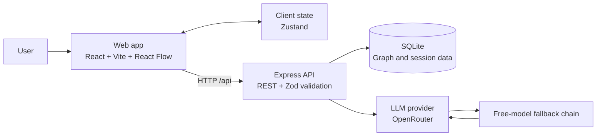
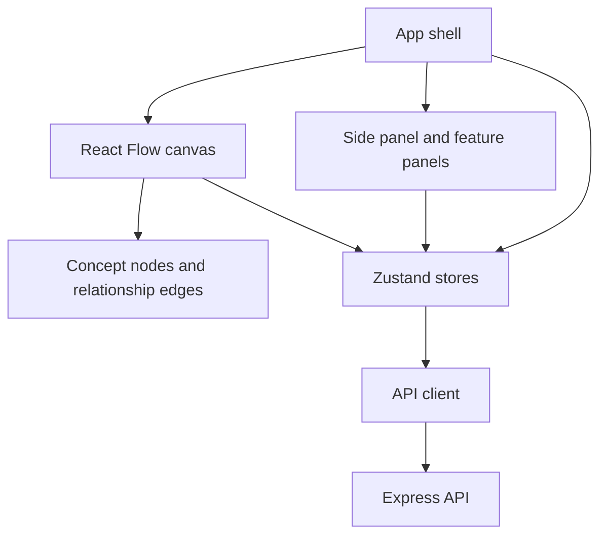
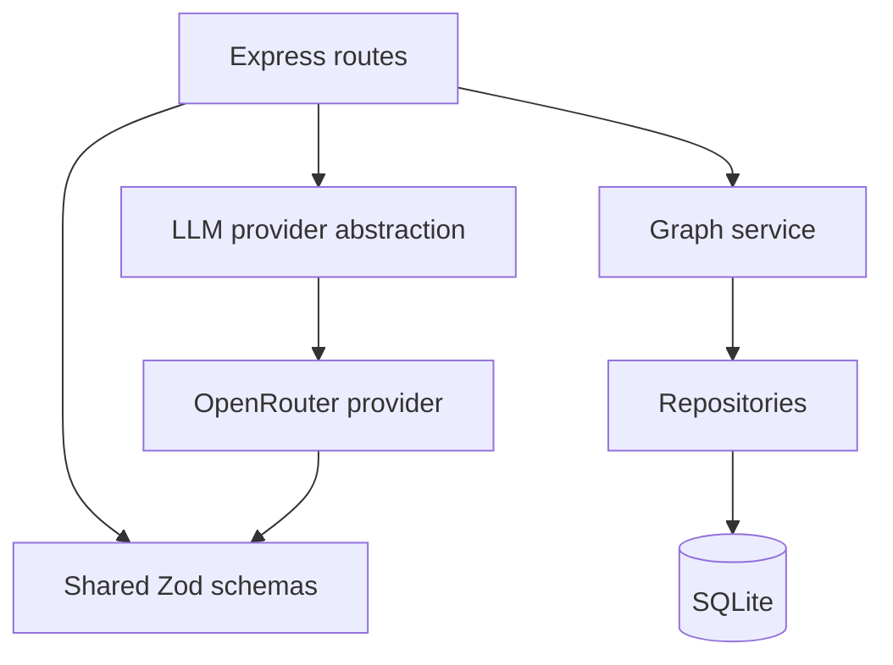
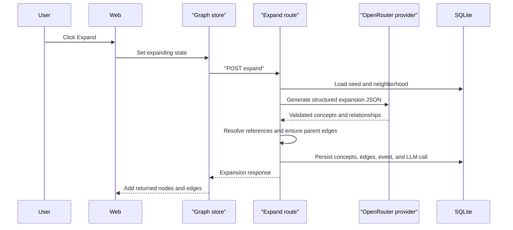
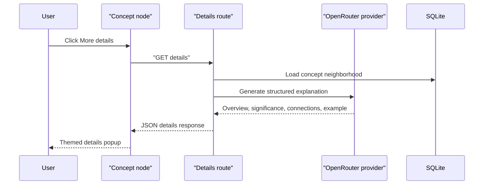

# Thinking Explorer Architecture

Thinking Explorer is a TypeScript monorepo for exploring concepts as an interactive graph. The web client owns the working graph view, while the server owns persistence, validation, and all LLM-backed mutations.

## Recent changes

- **LLM request dedupe.** `generateJson` checks the `llm_calls` cache by `request_hash` before every live call. Cache hits return the stored, re-validated response with `durationMs: 0`; misses fall through to the provider and fallback chain.
- **Seed exploration events.** `POST /api/sessions/:id/concepts` writes a `seed` event for manual concept creation. LLM-originated concepts (with `sourceNodeId`) are skipped — they already emit an `expand` event.
- **Concept search.** The side panel filters concepts by label substring (case-insensitive, local UI state only).

## System Overview



## Repository Structure

```text
synapse/
├── packages/shared/       Shared Zod schemas and TypeScript contracts
├── server/                Express API and SQLite persistence
│   ├── src/routes/        REST endpoints
│   ├── src/services/      Graph and LLM services
│   └── src/db/            SQLite client, migrations, repositories
├── web/                   React/Vite application
│   └── src/
│       ├── graph/         React Flow canvas, nodes, edges, layout
│       ├── state/         Zustand graph, selection, and filter stores
│       └── features/      Sessions, filters, details, trail, compare, challenge
└── scripts/               Smoke tests and development utilities
```

## Frontend Architecture



The canvas supports:

- Dragging cards and persisting their positions per session.
- Selecting a concept and focusing its neighborhood.
- Filtering concepts and relationships by category, type, and kind.
- Canvas zoom and pan, with popup scrolling isolated from React Flow.
- Fit and reset-layout controls.

User-created standalone concepts remain visible as graph entry points. Disconnected generated or derived concepts are hidden as orphans until they have a visible relationship.

The side panel concept list can be filtered by label substring (case-insensitive, local state only). This composes on top of the category/type/kind filters.

## Server Architecture



The server is the authority for graph mutations. Incoming requests and LLM responses are validated before data is persisted.

## Key Request Flows

### Expand a Concept



If the selected OpenRouter model is unavailable, the provider tries the configured fallback models. Timeouts, rate limits, and provider failures are reported as a single upstream error after the fallback chain is exhausted.

### Concept Details



## Persistence Model

SQLite stores:

- Sessions and timestamps.
- Concepts, including origin and source concept.
- Relationships, including type, kind, strength, and explanation.
- Per-session concept positions.
- Exploration events (the trail).
- LLM request and response records (audit + dedupe cache).

Concept deletion cascades through relationships and saved positions. Session deletion cascades through all session-owned graph data.

### Exploration events

Every LLM-backed operation writes an `exploration_events` row. Manual concept creation writes a `seed` event; LLM-originated concepts (which set `sourceNodeId`) are skipped because they already emit an `expand` event. The trail view renders these events in `created_at` order.

### LLM call cache

Before every live request, `generateJson` computes a `request_hash` from the normalized input and calls `lookupLLMCall`. On a hit it re-validates the stored response against the caller's schema and returns it with `durationMs: 0`, skipping the provider entirely. On a miss or parse failure it proceeds to the live call (and the fallback chain). Cache hits are never re-written; the original `llm_calls` row is reused.

## Reliability Boundaries

- Shared schemas validate client/server payloads.
- The server validates all LLM output before mutation.
- OpenRouter requests have configurable timeouts.
- Multiple free fallback models can be configured with `OPENROUTER_FALLBACK_MODELS`.
- The frontend clears loading states on both success and failure.
- A React error boundary prevents a graph rendering error from blanking the entire application.

## Development Commands

```powershell
npm install
npm run dev
npm run typecheck
npm run build
node scripts/smoke.mjs
```

The web client runs on `http://localhost:5173` and the API server runs on `http://localhost:4000` by default.
